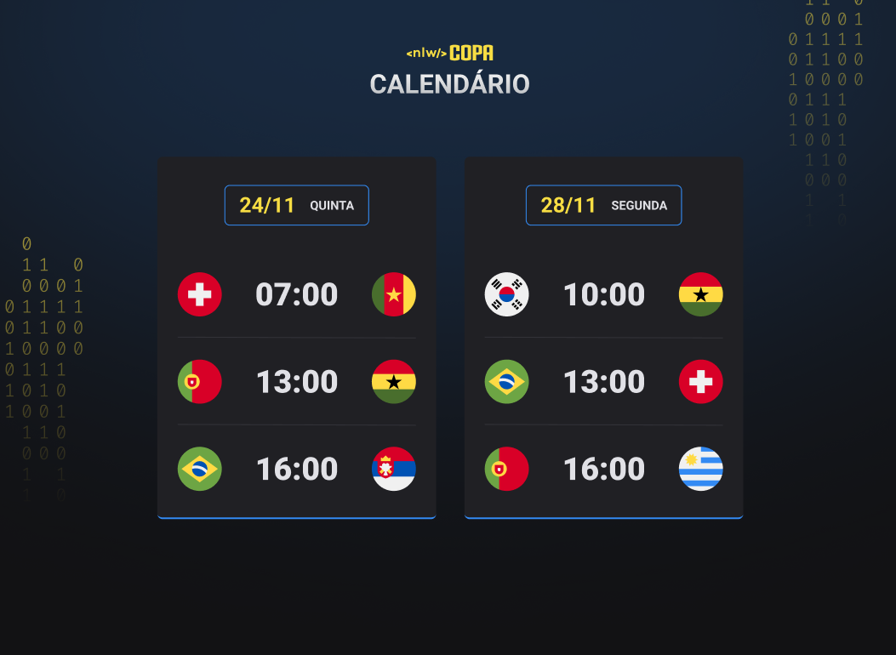

<h1 align="center"> Next Level Week - World Cup </h1>

An exclusive and free event, provided by Rocketseat, to exercise the practice of Web Technologies.

  <a href="#-technologies">Technologies</a>&nbsp;&nbsp;&nbsp;|&nbsp;&nbsp;&nbsp;
  <a href="#-project">Project</a>&nbsp;&nbsp;&nbsp;|&nbsp;&nbsp;&nbsp;
  <a href="#-layout">Layout</a>&nbsp;&nbsp;&nbsp;|&nbsp;&nbsp;&nbsp;
  <a href="#memo-license">License</a>

  

 

  

## 🚀 Technologies

This project was developed with the following technologies:

- HTML
- CSS
- JavaScript
- Git
- Github

## 💻 Project

In the Next Level Week #10, with a World Cup tematic, the project simulates a calendar with the real games of the Cup, using the main Web Technologies. The project also gives the possibility of changing colors with only CSS.

## 🔖 Layout

You can see the layout of the project through [THIS LINK](https://www.figma.com/file/goFDyVbmwhpKna2L35EHFs/Calend%C3%A1rio-de-Jogos-(Community)?node-id=0%3A1). It's necessary to have an account in  [Figma](https://figma.com) to open it.

## License

This projct is under the MIT license.

---

Join the  [community](https://discord.gg/rocketseat) of [Rocketseat](https://www.rocketseat.com.br/).